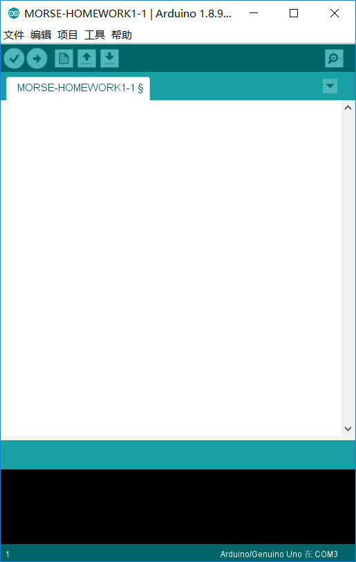
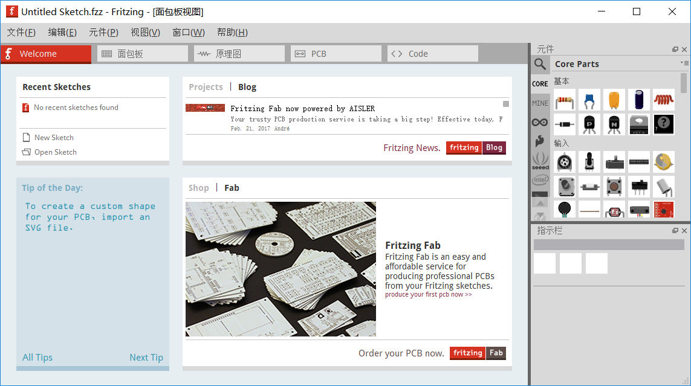
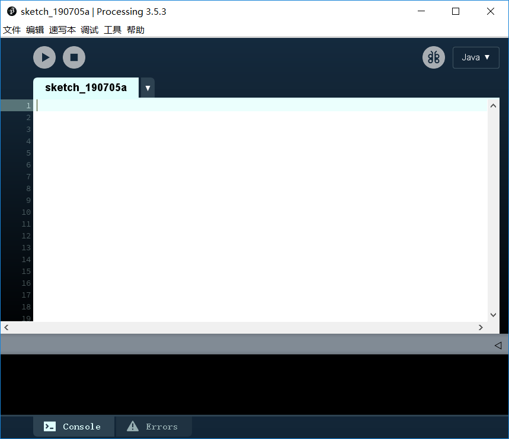
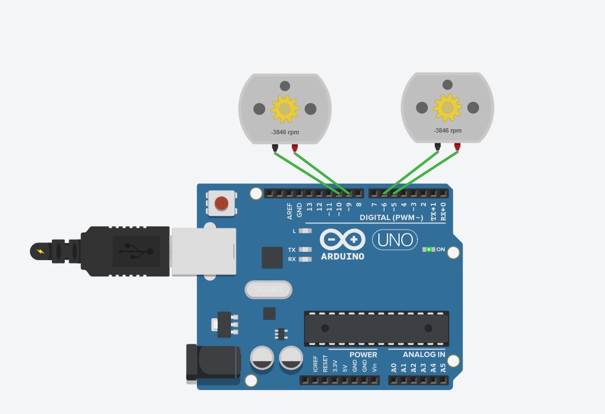

# hepiao
何飘的作业
# 何飘的开源硬件作业
何飘的作业

## 7月2日 第一天   入门介绍 

#### 学习内容

- 为什么要学习开源硬件
- 如何学习开源硬件
- 三个软件
     
     aiduino
	 

	 fritzing
	 

	 processing
	 

- 几个常用网站
      [arduino网址](https://arduino.cc)
      [fritzing网址](https://fritzing.org)
      [processing网址](https://processing.org)

- 介绍了Github
- 作业：
        注册Github账户  git@github.com:jiaxuesheng/hepiao.git
	下载安装三个软件：
		                Arduino
				processing
				fritzing

## 7月3日 第二天   软件操作

#### 学习内容
- 讲解了Arduino的基础编程语言，以及串口介绍
- Arduino的基本操作及类库
- arduino编程实例
      Morse code
	  Morse.h
	  ```
	  #include "Arduino.h"
      #include "Morse.h"

       Morse::Morse(int pin)
       {
	     pinMode(pin,OUTPUT);
	     _pin=pin;
	     _dottime=250;
        }

       void Morse::dot()
       {
	     digitalWrite(_pin,HIGH);
	     delay(_dottime);
	     digitalWrite(_pin,LOW);
	     delay(_dottime);
        } 
        void Morse::dash()
       {
	     digitalWrite(_pin,HIGH);
	     delay(_dottime*4);
	     digitalWrite(_pin,LOW);
	     delay(_dottime);
        }

        void Morse::c_space()
       {
	     digitalWrite(_pin,LOW);
	     delay(_dottime*2);
        }

        void Morse::w_space()
       {
	     digitalWrite(_pin,LOW);
	     delay(_dottime*4);
        }

      #ifndef _MORSE_H
      #define _MORSE_H
       class Morse
       {
         public:
         Morse(int pin);
         void dot();
         void dash();
         void c_space();
         void w_space();
         private:
         int _pin;
         int _dottime;
       };

     #endif /*_MORSE_H*/

     #include <Morse.h>
      Morse morse(13);
      int ZM = 0;
      void setup() 
      {
        Serial.begin(9600);
       }
      void loop()
	  {
        if(Serial.available() > 0)
		{
          ZM = Serial.read();
           if(ZM == 97){morse.dot();morse.dash();}
           else if(ZM == 98){morse.dash();morse.dot();morse.dot();morse.dot();}
           else if(ZM == 99){morse.dash();morse.dot();morse.dash();morse.dot();}
           else if(ZM == 100){morse.dash();morse.dot();morse.dot();}
           else if(ZM == 101){morse.dot();}
           else if(ZM == 102){morse.dot();morse.dot();morse.dash();morse.dot();}
           else if(ZM == 103){morse.dash();morse.dash();morse.dot();}
           else if(ZM == 104){morse.dot();morse.dot();morse.dot();morse.dot();}
           else if(ZM == 105){morse.dot();morse.dot();}
           else if(ZM == 106){morse.dot();morse.dash();morse.dash();morse.dash();}
    
           else if(ZM == 107){morse.dash();morse.dot();morse.dash();}
           else if(ZM == 108){morse.dot();morse.dash();morse.dot();morse.dot();}
           else if(ZM == 109){morse.dash();morse.dash();}
           else if(ZM == 110){morse.dash();morse.dot();}
           else if(ZM == 111){morse.dash();morse.dash();morse.dash();}
    
           else if(ZM == 112){morse.dot();morse.dash();morse.dash();morse.dot();}
           else if(ZM == 113){morse.dash();morse.dash();morse.dot();morse.dash();}
           else if(ZM == 114){morse.dot();morse.dash();morse.dot();}
           else if(ZM == 115){morse.dot();morse.dot();morse.dot();}
           else if(ZM == 116){morse.dash();}
     
           else if(ZM == 117){morse.dot();morse.dot();morse.dash();}
           else if(ZM == 118){morse.dot();morse.dot();morse.dot();morse.dash();}
           else if(ZM == 119){morse.dot();morse.dash();morse.dash();}
           else if(ZM == 120){morse.dash();morse.dot();morse.dot();morse.dash();}
           else if(ZM == 121){morse.dash();morse.dot();morse.dash();morse.dash();}
    
           else if(ZM == 122){morse.dash();morse.dash();morse.dot();morse.dot();}
           morse.c_space();
           else if(ZM == 32){morse.w_space();}
         }
     } 
	  ```

## 7月4日 第三天    网站演练：元器件及电路图

#### 学习内容

- 介绍并讲解在线模拟网站：
                    [tinkercad网址]( www.tinkercad.com )
- 讲解电机的使用，小车电路图及代码，PWM技术，7位译码器的使用，cd4511的使用

- 课堂作业：
         电机转向电路图及代码

		 
		 
		 ```
		 //f前进
         //b后退
         //l左转
         //r右转
         //s停止
         void setup()
         {
           pinMode(5, OUTPUT);
           pinMode(6, OUTPUT);
           pinMode(9, OUTPUT);
           pinMode(10, OUTPUT);
          Serial.begin(9600);
          }

         void loop()
        {
            int income;
             if(Serial.available()>0)
           {
            income=Serial.read();
            }
           switch(income)
            {
               case'f':forword();break;
               case'b':backword();break;
               case'r':right();break;
               case'l':left();break;
               case's':stop();break;
              }
           }  
            void forword()
            {
               digitalWrite(6,HIGH);
               digitalWrite(5,LOW);
               digitalWrite(10,HIGH);
               digitalWrite(9,LOW);
             }
  
             void backword()
            {
              digitalWrite(5,HIGH);
              digitalWrite(6,LOW);
              digitalWrite(9,HIGH);
              digitalWrite(10,LOW);
             }
  
             void left()
             {
               digitalWrite(5,HIGH);
               digitalWrite(6,LOW);
               digitalWrite(10,HIGH);
               digitalWrite(9,LOW);
              }
  
              void right()
              {
                digitalWrite(6,HIGH);
                digitalWrite(5,LOW);
                digitalWrite(9,HIGH);
                digitalWrite(10,LOW);
              }
  
               void stop()
             {
                digitalWrite(6,LOW);
                digitalWrite(5,LOW);
                digitalWrite(10,LOW);
                digitalWrite(9,LOW);
              }
		 ```
-课后作业：
         7位数码显示管

		 

		 ```
		 void setup()
          {
             pinMode(3, OUTPUT);
             pinMode(4, OUTPUT);
             pinMode(5, OUTPUT);
             pinMode(6, OUTPUT);
             pinMode(7, OUTPUT);
             Serial.begin(9600);
           }
          void loop()
        {
 
            int income;
            if(Serial.available()>0)
           {
            income=Serial.read();
            income = income - '0';
            if(income==0)
            { 
             digitalWrite(7,LOW);
    
             digitalWrite(3,LOW);
             digitalWrite(4,LOW);
             digitalWrite(5,LOW);
             digitalWrite(6,LOW);
            }
            else if(income==1)
            {
              digitalWrite(7,LOW);
      
              digitalWrite(3,HIGH);
              digitalWrite(4,LOW);
              digitalWrite(5,LOW);
              digitalWrite(6,LOW);
             }
            else if(income==2)
            {
              digitalWrite(7,LOW);
      
              digitalWrite(3,LOW);
              digitalWrite(4,HIGH);
              digitalWrite(5,LOW);
              digitalWrite(6,LOW);
    

             }
             else if(income==3)
            {
              digitalWrite(7,LOW);
     
              digitalWrite(3,HIGH);
              digitalWrite(4,HIGH);
              digitalWrite(5,LOW);
              digitalWrite(6,LOW);
      

             }
            else if(income==4)
            {
               digitalWrite(7,LOW);
     
               digitalWrite(3,LOW);
               digitalWrite(4,LOW);
               digitalWrite(5,HIGH);
               digitalWrite(6,LOW);
      

              }
             else if(income==5)
             {
               digitalWrite(7,LOW);
      
               digitalWrite(3,HIGH);
               digitalWrite(4,LOW);
               digitalWrite(5,HIGH);
               digitalWrite(6,LOW);
     

             }
             else if(income==6)
             {
               digitalWrite(7,LOW);
    
               digitalWrite(3,LOW);
               digitalWrite(4,HIGH);
               digitalWrite(5,HIGH);
               digitalWrite(6,LOW);
      

              }
             else if(income==7)
             {
                digitalWrite(7,LOW);
      
                digitalWrite(3,HIGH);
                digitalWrite(4,HIGH);
                digitalWrite(5,HIGH);
                digitalWrite(6,LOW);
      

              }
              else if(income==8)
              {
                 digitalWrite(7,LOW);
      
                 digitalWrite(3,LOW);
                 digitalWrite(4,LOW);
                 digitalWrite(5,LOW);
                 digitalWrite(6,HIGH);
       

               }
               else if(income==9)
               {
                 digitalWrite(7,LOW);
      
                 digitalWrite(3,HIGH);
                 digitalWrite(4,LOW);
                 digitalWrite(5,LOW);
                 digitalWrite(6,HIGH);
     
	  
                } 
           }
         }
	   ```

## 7月5日 第四天  课堂总结

####学习内容

-总结内容
-课堂答疑
-课后作业：Morse cade 仿真，撰写总结报告完善github仓库格式
        
		Morse 电路
		  
		  

		  ```
		  
             void loop() 
             {
                Morse morse(13);
                int ZM = 0;
                if(Serial.available() > 0)
                {
                   ZM = Serial.read();
                   if(ZM == 97){morse.dot();morse.dash();}
                   if(ZM == 98){morse.dash();morse.dot();morse.dot();morse.dot();}
                   if(ZM == 99){morse.dash();morse.dot();morse.dash();morse.dot();}
                   if(ZM == 100){morse.dash();morse.dot();morse.dot();}
                   if(ZM == 101){morse.dot();}
                   if(ZM == 102){morse.dot();morse.dot();morse.dash();morse.dot();}
                   if(ZM == 103){morse.dash();morse.dash();morse.dot();}
                   if(ZM == 104){morse.dot();morse.dot();morse.dot();morse.dot();}
                   if(ZM == 105){morse.dot();morse.dot();}
                   if(ZM == 106){morse.dot();morse.dash();morse.dash();morse.dash();}
    
                   if(ZM == 107){morse.dash();morse.dot();morse.dash();}
                   if(ZM == 108){morse.dot();morse.dash();morse.dot();morse.dot();}
                   if(ZM == 109){morse.dash();morse.dash();}
                   if(ZM == 110){morse.dash();morse.dot();}
                   if(ZM == 111){morse.dash();morse.dash();morse.dash();}
    
                   if(ZM == 112){morse.dot();morse.dash();morse.dash();morse.dot();}
                   if(ZM == 113){morse.dash();morse.dash();morse.dot();morse.dash();}
                   if(ZM == 114){morse.dot();morse.dash();morse.dot();}
                   if(ZM == 115){morse.dot();morse.dot();morse.dot();}
                   if(ZM == 116){morse.dash();}
    
                   if(ZM == 117){morse.dot();morse.dot();morse.dash();}
                   if(ZM == 118){morse.dot();morse.dot();morse.dot();morse.dash();}
                   if(ZM == 119){morse.dot();morse.dash();morse.dash();}
                   if(ZM == 120){morse.dash();morse.dot();morse.dot();morse.dash();}
                   if(ZM == 121){morse.dash();morse.dot();morse.dash();morse.dash();}
    
                   if(ZM == 122){morse.dash();morse.dash();morse.dot();morse.dot();}
                   morse.c_space();
                   if(ZM == 32){morse.w_space();}
                 }
              } 
           
		   ```
		
